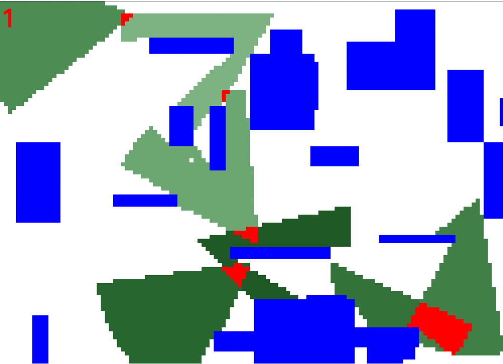

# ga_auto_deployment_cameras

## Automatic deployment cameras on the space with objects(buildings, barriers) using a genetic algorithm

The project uses a genetic algorithm library named [GALGO 2.0](https://github.com/olmallet81/GALGO-2.0) 

Sample:

> 
